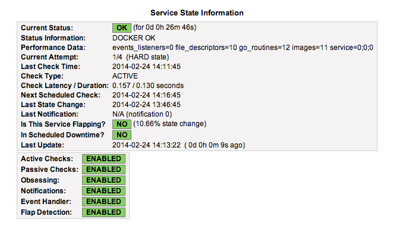

# check_docker

check_docker is a [Nagios](http://www.nagios.org) plugin to check [Docker's](https://www.docker.io/) system-wide stats.  The stats returned are equivalent to the stats returned by running the `docker info` command.

### Installation

copy check_docker somewhere in your path.  This document assumes /usr/local/bin.

	cp check_docker /usr/local/bin/
	chmod +x /usr/local/bin/check_docker

###  Conifguration

#### Docker 

The Docker API can be accessed from a URL.    On Ubuntu 13.10, the default URL is a socket (`unix://var/run/docker.sock`), however, this requires additional configuration for Nagios because it must act as a priviledged user (using sudo) to access.

The other alternative is to access the API via a URL, but that must be enabled in `/etc/init/docker.conf`:

Make sure you set the `DOCKER_OPTS` value:

	DOCKER_OPTS='-H tcp://127.0.0.1:4243'
	
The default	method check_docker uses is the URL but will fall back to the socket if it is not available.  Additionally, the URL can be specified as on option to check_docker.

#### Nagios

For the sake of this excercise, we'll assume that the Docker installation is on the same machine as the Nagios server.  This plugin can also be run against remote clients [using the nagios-nrpe method](http://devincharge.com/quick-dirty-setup-nrpe-ubuntu/). 

Create a command definition file.  On Ubuntu 13.10, that can be done like this:

	cat << EOF > /etc/nagios-plugins/config/docker.cfg 
	define command{
	    command_name    check_docker_http
	    command_line    /usr/local/bin/check_docker --url http://127.0.0.1:4243 
	    }
	
	define command{
	    command_name    check_docker_socket
	    command_line    sudo /usr/local/bin/check_docker
	    }
	EOF

If you are using the socket URL to access the API, on each monitored host, you'll need to:

	echo 'nagios        ALL=(root) NOPASSWD: /usr/local/bin/check_docker' > /etc/sudoers.d/nagios

### Usage

	usage: check_docker [-h] [-u URL] [-t TIMEOUT] [-v]
	
	optional arguments:
	  -h, --help            show this help message and exit
	  -u URL, --url URL     URL string for Docker service.
	  -t TIMEOUT, --timeout TIMEOUT
	                        abort execution after TIMEOUT seconds
	  -v, --verbose         increase output verbosity (use up to 3 times)

### Sample Output

Service is running:

    DOCKER OK | events_listeners=0 file_descriptors=10 go_routines=12 images=11 service=0;0;0

Service is not running:

	DOCKER CRITICAL - (outside range 0:0) | service=1;0;0

The following stats are returned:

| Name           | Description                        |
| -------------- | -----------------------------------|
| images | total number of docker images installed |
|go_routines| the number of Go threads |
| file_descriptors| the number of used file descriptors |
| events_listeners| the number of events_listeners processes |

### Dependencies

Requires the following modules installable using pip:

* [docker-py](https://github.com/dotcloud/docker-py)
* [nagiosplugin](http://pythonhosted.org/nagiosplugin/)

To install this you can run:

    pip install -r requirements.txt
	
	
### User Interface

